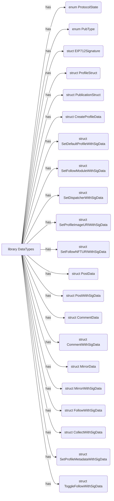

# Diagram

## Lens Protocol

```mermaid
classDiagram 
    direction LR
    class ILensHub {
        <<interface>>
        This is the interface for the LensHub contract, the main entry point for the Lens Protocol.
        initialize(string calldata name, string calldata symbol, address newGoverance)
        setGovernance(address newGovernance)
        setEmergencyAdmin(address newEmergencyAdmin)
        setState(ProtocolState newState)
        whitelistProfileCreator(address profileCreator, bool whitelist)
        whitelistProfileCreator(address profileCreator, bool whitelist)
        whitelistReferenceModule(address referenceModule, bool whitelist)
        whitelistCollectModule(address collectModule, bool whitelist)
        createProfile(CreateProfileData calldata vars)
        setDefaultProfile(uint256 profileId)
        setDefaultProfileWithSig(SetDefaultProfileWithSigData calldata vars)
        setFollowModule(uint256 profileId, address followModule, bytes calldata followModuleInitData)
        setFollowModuleWithSig(SetFollowModuleWithSigData calldata vars)
        setDispatcher(uint256 profileId, address dispatcher)
        setDispatcherWithSig(SetDispatcherWithSigData calldata vars)
        setProfileImageURI(uint256 profileId, string calldata imageURI)
        setProfileImageURIWithSig(SetProfileImageURIWithSigData calldata vars)
        setFollowNFTURI(uint256 profileId, string calldata followNFTURI)
        setFollowNFTURIWithSig(SetFollowNFTURIWithSigData calldata vars)
        post(PostData calldata vars)
        postWithSig(PostWithSigData calldata vars)
        comment(CommentData calldata vars)
        commentWithSig(CommentWithSigData calldata vars)
        mirror(MirrorData calldata vars)
        mirrorWithSig(MirrorWithSigData calldata vars)
        follow(uint256[] calldata profileIds, bytes[] calldata datas)
        followWithSig(FollowWithSigData calldata vars)
        collect(uint256 profileId, uint256 pubId, bytes calldata data)
        collectWithSig(CollectWithSigData calldata vars)
        emitFollowNFTTransferEvent(uint256 profileId, uint256 followNFTId, address from, address to)
        emitCollectNFTTransferEvent(uint256 profileId, uint256 pubId, uint256 collectNFTId, address from, address to)
        isProfileCreatorWhitelisted(address profileCreator): bool
        defaultProfile(address wallet): uint256
        isFollowModuleWhitelisted(address followModule): bool
        isReferenceModuleWhitelisted(address referenceModule): bool
        isCollectModuleWhitelisted(address collectModule): bool
        getGovernance(): address
        getDispatcher(uint256 profileId): address
        getPubCount(uint256 profileId): uint256
        getFollowNFT(uint256 profileId): address
        getFollowNFTURI(uint256 profileId): string
        getCollectNFT(uint256 profileId, uint256 pubId): address
        getFollowModule(uint256 profileId): address
        getCollectModule(uint256 profileId, uint256 pubId): address
        getReferenceModule(uint256 profileId, uint256 pubId): address
        getHandle(uint256 profileId): string
        getPubPointer(uint256 profileId, uint256 pubId): uint256, uint256
        getContentURI(uint256 profileId, uint256 pubId): string
        getProfileIdByHandle(string calldata handle): uint256
        getProfile(uint256 profileId): ProfileStruct
        getPub(uint256 profileId, uint256 pubId): PublicationStruct
        getPubType(uint256 profileId, uint256 pubId): PubType
        getFollowNFTImpl(): address
        getCollectNFTImpl(): address
    }
    class IReferenceModule {
        <<interface>>
        This is the standard interface for all Lens-compatible ReferenceModules.
        initializeReferenceModule(uint256 profileId,uint256 pubId,bytes calldata data)
        processComment(uint256 profileId,uint256 profileIdPointed,uint256 pubIdPointed,bytes calldata data)
        processMirror(uint256 profileId,uint256 profileIdPointed,uint256 pubIdPointed,bytes calldata data)
    }
    class IModuleGlobals {
        <<interface>>
        This is the interface for a data providing contract
        setGovernance(address newGovernance)
        setTreasury(address newTreasury)
        setTreasuryFee(uint16 newTreasuryFee)
        whitelistCurrency(address currency, bool toWhitelist)
        isCurrencyWhitelisted(address currency): bool
        getGovernance(): address
        getTreasury(): address
        getTreasuryFee(): uint16
        getTreasuryData(): address, uint16
    }
    class ILensNFTBase {
        <<interface>>
        This is the interface for the LensNFTBase contract, from which all Lens NFTs inherit.
        permit(adress spender, uint256 tokenId,EIP712Signature calldata sig)
        permitForAll(address owner, address operator,bool approved, EIP712Signature calldata sig)
        burn(uint256 tokenId)
        burnWithSig(uint256 tokenId, EIP712Signature calldata sig)
        getDomainSeparator():bytes32
    }
    class IFollowNFT {
        <<interface>>
        This is the interface for the FollowNFT contract, which is cloned upon the first follow for any profile
        initialize(uint256 profileId)
        mint(address to):uint256
        delegate(address delegatee)
        delegateBySig(address delegator,address delegatee,EIP712Signature calldata sig)
        getPowerByBlockNumber(address user, uint256 blockNumber): uint256
        getDelegatedSupplyByBlockNumber(uint256 blockNumber): uint256
    }
    class IFollowModule {
        <<interface>>
        This is the standard interface for all Lens-compatible FollowModules.
        initializeFollowModule(uint256 profileId, bytes calldata data)
        processFollow(address follower, uint256 profileId, bytes calldata data)
        followModuleTransferHook(uint256 profileId, address from, address to, uint256 followNFTTokenId)
        isFollowing(uint256 profileId, address follower, uint256 followNFTTokenId): bool
    }
    class ICollectNFT {
        <<interface>>
        This is the interface for the CollectNFT contract. Which is cloned upon the first collect for any given publication.
        initialize(uint256 profileId, uint256 pubId, string calldata name, string calldata symbol)
        mint(address to): uint256
        getSourcePublicationPointer(): uint256, uint256
    }
    class ICollectModule {
        <<interface>>
        This is the standard interface for all Lens-compatible CollectModules.
        initializePublicationCollectModule(uint256 profileId, uint256 pubId, bytes calldata data)
        processCollect(uint256 referrerProfileId, address collector, uint256 profileId, uint256 pubId, bytes calldata data)
    } 
```

```mermaid
flowchart LR
    a[library DataTypes]
    b(enum ProtocolState)
    c(enum PubType)
    d(stuct EIP712Signature)
    e(struct ProfileStruct)
    f(struct PublicationStruct)
    g(struct CreateProfileData)
    h(struct SetDefaultProfileWithSigData)
    i(struct SetFollowModuleWithSigData)
    j(struct SetDispatcherWithSigData)
    k(struct SetProfileImageURIWithSigData)
    l(struct SetFollowNFTURIWithSigData)
    m(struct PostData)
    n(struct PostWithSigData)
    o(struct CommentData)
    p(struct CommentWithSigData)
    q(struct MirrorData)
    r(struct MirrorWithSigData)
    s(struct FollowWithSigData)
    t(struct CollectWithSigData)
    u(struct SetProfileMetadataWithSigData)
    v(struct ToggleFollowWithSigData)
    a -->|has| b & c & d & e & f & g & h & i & j & k & l & m & n & o & p & q & r & s & t & u & v
```
