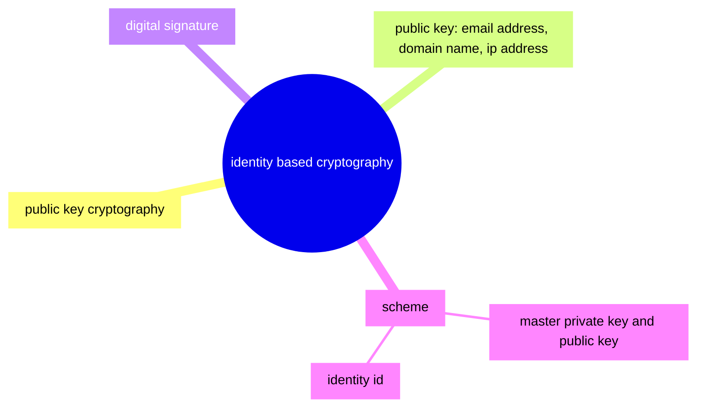

```mermaid
mindmap
    theme((identity based cryptography))
        type[public key cryptography]
        key[public key: email address, domain name, ip address]
        signature[digital signature]
        usage[scheme]
            master[master private key and public key]
            identity[identity id]
```            
